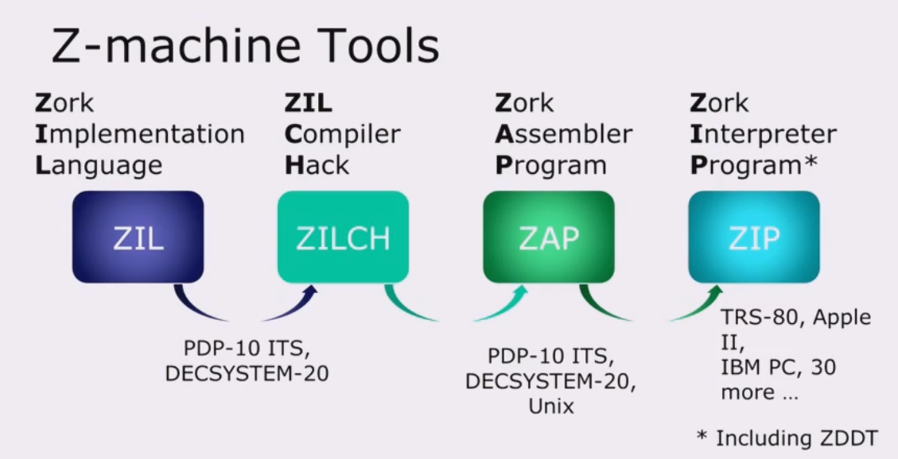
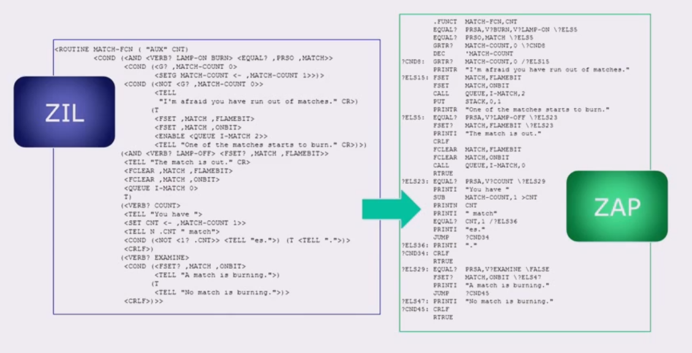
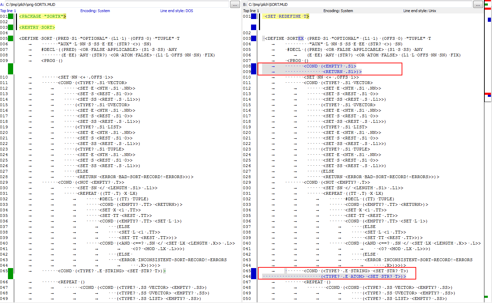
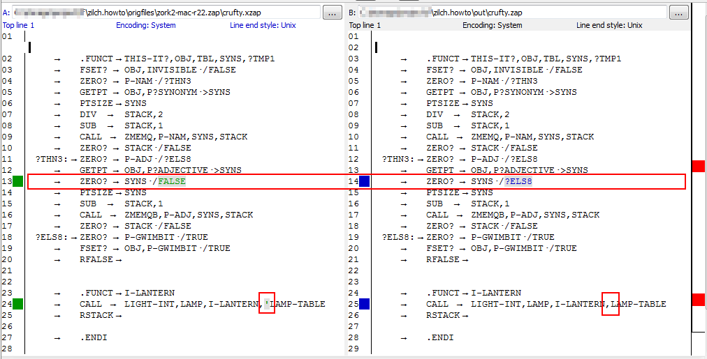

# ZILCH How-to

How to bring `ZILCH` back to life again.

## Motivation

Since I was a teenager, I wanted to know the
[internal secrets](https://github.com/ZoBoRf/InternalSecretsOfInfocomGames) of
[Infocom adventures](http://www.infocom-if.org/)
and the software and [hardware systems](https://github.com/PDP-10)
used to build them. (My fascination was only the slowed down by the language.
I had to learn English first.)

Best known are the articles
  * Lebling, Blank and Anderson, "[Special Feature Zork: A Computerized Fantasy Simulation Game](https://www.computer.org/csdl/magazine/co/1979/04/01658697/13rRUwfqpJ1)", in Computer, vol. 12, no. 4, pp. 51-59, April 1979, doi: 10.1109/MC.1979.1658697.
  * Marc S. Blank und S. W. Galley, "[How to Fit a Large Program Into a Small Machine](https://archive.org/details/creativecomputing-1980-07/page/n81/mode/1up)
    or How to fit the Great Underground Empire on your desk-top"
    in Creative Computing, vol 6 no 7, pp. 80-88, July 1980, and
  * P. David Lebling, "[Zork and the Future of Computerized Fantasy Simulations](https://archive.org/details/byte-magazine-1980-12/page/n173/mode/1up)" BYTE Magazine, pp. 172-182 December 1980.

And then there is "[Down From the Top of Its Game - The Story of Infocom, Inc.](http://web.mit.edu/6.933/www/Fall2000/infocom/infocom-paper.pdf)"

Much was written, but the exact workings of the tools used, remained vague
and for many years it was thought the tools
[Infocom](https://en.wikipedia.org/wiki/Infocom) used to create
their legendary interactive fiction works was lost forever.

Then 2008 [Andy Baio](https://twitter.com/waxpancake) made public
[details](https://waxy.org/2008/04/milliways_infocoms_unreleased_sequel_to_hitchhikers_guide_to_the_galax/) ([What a lose](http://www.catb.org/~esr/jargon/html/L/lose.html)!)
from the legendary Infocom Drive. An anonymous source close to the company
gave him a complete backup of Infocom's shared network drive from 1989.


At PAX East 2010 someone "lost" some
[USB Drives](http://www.ifwiki.org/index.php/PAX_USB_Drive),
which - after some puzzle solving - revealed interesting
internal Infocom development documents:

| Title                                                  | File Name        |
| ------------------------------------------------------ | ---------------- |
| Vocabulary and syntax compaction                       | compact.txt      |
| Conditional compilation                                | conditional.doc  |
| What should (or may) be in your `game.ZIL` file.       | game-zil.doc     |
| WRITER'S GUIDELINES FOR ZIL                            | guidelines.text  |
| About "support in ZILCH for shared code libraries"     | libraries.txt    |
| Accessing low core locations                           | lowcore.txt      |
| New xzip instructions ... required for multi-player games | multi-player.txt |
| "EXTENDED ZIPTEST" [of Multiplayer Functionality]      | multi-player.zil |
| INTERLOGIC WRITER'S GUIDELINES                         | newguide.mss     |
| USER-DEFINABLE PROPERTIES                              | propdef.txt      |
| EZIP: Z-language Interpreter Program (Expanded)        | spec-ezip.fwf    |
| [ZAP: Z-language Assembly Program](https://github.com/ZoBoRf/ZAPSpec) | spec-zap.fwf     |
| ZIP: Z-language Interpreter Program                    | spec-zip.rno     |
| Enhancements to `TABLE`s                               | table.doc        |
| New `TELL` Macro                                       | tell.doc         |
| ZIP: Z-language Interpreter Program                    | xzip.txt         |
| YZIP is ZIP version 6                                  | yzip.txt         |
| [ZIL Course](https://github.com/ZoBoRf/ZILCourse)      | zil-course.fwf   |
| The Zork Implementation Language                       | zil.doc          |
| Changes to ZILCH                                       | zilch.new        |

In addition
*[Learning ZIL](https://github.com/ZoBoRf/LearningZIL) or Everything You Always Wanted to Know About Writing Interactive Fiction But Couldn't Find Anyone Still Working Here to Ask* by Steven Eric Meretzky could be found on the [Internet Archive](https://archive.org/details/Learning_ZIL_Steven_Eric_Meretzky_1995) for quite some time.

At the *Game Developers Conference* 2014 Dave Lebling gave a talk with the title
"[Classic Game Postmortem: Zork](https://www.gdcvault.com/play/1020612/Classic-Game-Postmortem)"
where near minute 24 he shows some interesting slides, the first one
reveals the names of the tools used and the machines the tool chain
was running at:



The second one shows a code snippet which illustrates the
translation process from `ZIL` to `ZAP` accomplished by `ZILCH`,
the `ZIL Compiler`. The slide compares the `ZIL` `MATCH-FCN` routine
in source and compiled form. This was the first time I saw a direct comparison
between `ZIL` and `ZAP` code.



The third slide shows the difference between Muddle code used in the original
mainframe Muddle [Zork](https://github.com/PDP-10/zork-1) and the ZIL Zork
objects.

At Apr 16, 2019 Jason Scott, the best known internet archivist
in a courageous step
[released](https://twitter.com/textfiles/status/1118005126457888768?lang=en)
the [Infocom source code](https://github.com/historicalsource) on GitHub.

Based on this and other sources
[Andrew Plotkin](https://twitter.com/zarfeblong) created the
[The Obsessively Complete Infocom Catalog](https://eblong.com/infocom/).

I was especially interested in the source code of `Zork II` packed in 
[zork2-mac-r22.zip](https://eblong.com/infocom/sources/zork2-mac-r22.zip) 
because the archive contains the complete compiled `ZAP` files as well.

[Jesse McGrew](https://www.facebook.com/public/Jesse-McGrew) created the
open source ZIL Compiler [ZILF](https://foss.heptapod.net/zilf/zilf/) many
years ago, so we don't need `ZILCH` for creating new interactive fiction
stories. Nevertheless my motivation is to bring back to life the really lost
masterpieces of Infocom, first of all `ZILCH`.

Apr 30, 2019 [Lars Brinkhoff](https://twitter.com/larsbrinkhoff) made a
single commit to the [https://github.com/PDP-10/zil](https://github.com/PDP-10/zil)
GitHub repository.
Lars Brinkhoff is the researcher, wo helped identifying and extracting
the original [Muddle Zork](https://github.com/MITDDC/zork) files from
the [MIT Tapes of Tech Square (ToTS)](https://archivesspace.mit.edu/repositories/2/resources/1265) collection.

Here are the contents of the [https://github.com/PDP-10/zil](https://github.com/PDP-10/zil) repository:
```
<ZORK.Z>APPLY.MUD.1       Mar  5  1981
<ZORK.Z>GETSTR.MUD.2      Nov  5  1979
<ZORK.Z>IBYTES.MUD.2      Oct 26  1979
<ZORK.Z>ZAC.MUD.18        Nov 13  1979
<ZORK.Z>ZAP.MUD.171       Jan 18  1980
<ZORK.Z>ZIL.MUD.176       Oct 29  1980
<ZORK.Z>ZILCH.MUD.188     Nov  3  1980
<ZORK.Z>ZIP.MUD.96        Dec 15  1979
<ZORK.Z>ZIPOUT.MUD.2      Feb 29  1980
<ZORK.Z>ZIPUTIL.MUD.3     Dec 15  1979
<ZORK.Z>ZOPS.MUD.18       Jan 17  1980
<ZORK.Z>ZSTR.MUD.2        Sep  3  1979

<ZORK.ZFTP>ZFTP.MUD.12    Jun  7  1980
```

So I can safely say that April 2019 was one of the most exciting months of my life.

Sep 01, 2020 I asked him on the IRC channel #pdp-10 on freenode

> ```
> <ZoBoRf> larsb: Where did the files in 
>          https://github.com/PDP-10/zil originally come from?
> <larsb> I think from the Infocom drive.
> <larsb> No, that's not right.
> <larsb> That's from a MIT TOPS-20 machine.
> <larsb> It's from ToTS, same as the ITS files.
> <larsb> I like the ring of that, "ITS files".
> <larsb> The truth is out there!
> <ZoBoRf> larsb: I wanted say something about
>          the origin of the files in my zilch writeup.
> <ZoBoRf> But as I see it is better to be fuzzy about the truth?
>         May I quote your info verbatim?
> <larsb> I don't think it's a secret it's from ToTS.
> <larsb> Yes, you may quote me or rewrite the text as you like
> <larsb> We had help from "Mr X" who helped get the files.
>         I believe CSAIL was aware what was going on.
>         Even a senior professor helped me get one particular file.
> <larsb> http://people.csail.mit.edu/devon/archive/
> <larsb> There's some public information.
> ```

### Distant Goal: Literate Version of **ZILCH: The Program**

Now, that I know there is a `ZILCH` compiler available,
my idea is to document it in a [literate programming](http://www.literateprogramming.com/) style,
introduced by [Donald E. Knuth](https://www-cs-faculty.stanford.edu/~knuth/lp.html)
in which a computer program is given an explanation of its
logic in a natural language,
such as English, interspersed with snippets of macros and
traditional source code, from which compilable source
code can be generated. Knuth used literate programming to write
and document his famous typesetting program TeX still in wide use today.
I'm going to do that with [Nuweb](https://github.com/ZoBoRf/nuweb)
which I made some small changes to.

But before I do something like this, I should be sure that the work is not in vain.
The best is to let the compiler translate some code
and compare the code with some code we know is generated by
a `ZILCH` compiler in the eighties.

### Zork II

To do this I take the `Zork II` sources mentioned above
and unpack them:

```
| File Name      |    Size |
| -------------- | ------- |
| actions.cmp    |    1576 |
| actions.zap    |  103567 |
| actions.zil    |  120560 |
| clock.zap      |    1042 |
| clock.zil      |    1618 |
| crufty.xzap    |     495 |
| crufty.zil     |     635 |
| demons.zap     |    1128 |
| demons.zil     |    1303 |
| dungeon.cmp    |    1300 |
| dungeon.zap    |       8 |
| dungeon.zil    |   69088 |
| macros.zap     |     220 |
| macros.zil     |    2324 |
| main.zap       |    3185 |
| main.zil       |    3918 |
| parser.zap     |   21007 |
| parser.zil     |   29701 |
| syntax.zap     |       8 |
| syntax.zil     |   14584 |
| verbs.zap      |   39896 |
| verbs.zil      |   45454 |
| zork2.errors   |     585 |
| zork2.xzap     |     294 |
| zork2.zap      |     273 |
| zork2.zil      |     915 |
| zork2dat.zap   |  180229 |
| zork2freq.xzap |    3908 |
| zork2str.zap   |   36686 |
| -------------- | ------- |
| Bytes          |  685507 |
| Files          |      29 |
```

All we have to do is to let `ZILCH` compile the `ZIL` files
and check the generated `ZAP` files against the given ones.

Let me group and rearrange the files:

```
zork2.errors
zork2.zil     zork2.zap       zork2.xzap
                              zork2freq.xzap
              zork2dat.zap
dungeon.zil   dungeon.zap
syntax.zil    syntax.zap
macros.zil    macros.zap
clock.zil     clock.zap
main.zil      main.zap
parser.zil    parser.zap
demons.zil    demons.zap
crufty.zil    crufty.xzap
verbs.zil     verbs.zap
actions.zil   actions.zap
              zork2str.zap
actions.cmp
dungeon.cmp
```

* `zork2.errors` is the transcript of the `X-ZAP` assembler

```
Assembling ZORK2.XZAP.10


Inserting ZORK2FREQ.XZAP.5 (  616 bytes)
Inserting ZORK2DAT.ZAP.1   (17170 bytes)
Inserting DUNGEON.ZAP.1    (    0 bytes)
Inserting SYNTAX.ZAP.1     (    0 bytes)
Inserting MACROS.ZAP.1     (   42 bytes)
Inserting CLOCK.ZAP.1      (  197 bytes)
Inserting MAIN.ZAP.1       (  628 bytes)
Inserting PARSER.ZAP.1     ( 4076 bytes)
Inserting DEMONS.ZAP.1     (  277 bytes)
Inserting CRUFTY.XZAP.7    (   89 bytes)
Inserting VERBS.ZAP.1      ( 9969 bytes)
Inserting ACTIONS.ZAP.1    (32301 bytes)
Inserting ZORK2STR.ZAP.1   (17699 bytes)
17850 bytes of preload.

83128 bytes (82K).
244 objects.
147 globals.
```
`XZAP` assembles the `zork2.xzap` file (version 10).
The given size 83128 equals 64 bytes header plus the sum of 616, 17170, up to 17699 bytes.
The filenames are in [`TOPS-20`](https://en.wikipedia.org/wiki/TOPS-20) naming convention (see CHAPTER 4, "FILE SPECIFICATIONS" of the [*TOPS-20 User's Guide*](https://github.com/ZoBoRf/MEM2TeX/blob/master/examples/users/USERS.MEM.pdf)).
In my GitHub repository [`MEM2TeX`](https://github.com/ZoBoRf/MEM2TeX) are PDF versions of the [*TOPS-20 User's Guide*](https://github.com/ZoBoRf/MEM2TeX/blob/master/examples/users/USERS.MEM.pdf)
and [*TOPS-20 Commands Reference Manual*](https://github.com/ZoBoRf/MEM2TeX/blob/master/examples/users/USERS.MEM.pdf).
* `zork2.xzap`

When we look into `zork2.xzap` we can see
it just includes all the other `ZAP` and `XZAP` files.

```
        .INSERT "ZORK2FREQ"
        .INSERT "ZORK2DAT"                      ; DATA IS IN THIS FILE
        .INSERT "DUNGEON"
        .INSERT "SYNTAX"
        .INSERT "MACROS"
        .INSERT "CLOCK"
        .INSERT "MAIN"
        .INSERT "PARSER"
        .INSERT "DEMONS"
        .INSERT "CRUFTY"
        .INSERT "VERBS"
        .INSERT "ACTIONS"
        .INSERT "ZORK2STR"
        .END
```

* `zork2.zap`

In `zork2.zap` the only difference to `zork2.xzap` is
the missing first line:

```
        .INSERT "ZORK2FREQ"
```

* `zork2freq.xzap`

The frequent words file defines
the word frequency table with the 96 most common words:

```
        .FSTR FSTR?1,"the "        ;1642      821
        .FSTR FSTR?2,"The "        ;1122      374
        .FSTR FSTR?3,"You "        ;573       191
        .FSTR FSTR?4,"and "        ;548       274
        .FSTR FSTR?5,"There "      ;545       109
        .FSTR FSTR?6,", "          ;498       498
...
        .FSTR FSTR?51,"balloon "   ;84        14
        .FSTR FSTR?52,"Frobozz "   ;84        12
        .FSTR FSTR?53,"I "         ;83        83
        .FSTR FSTR?54,"it "        ;80        80
...
        .FSTR FSTR?92,"Nothing "   ;63        9
        .FSTR FSTR?93,"as "        ;60        60
        .FSTR FSTR?94,"south "     ;60        15
        .FSTR FSTR?95,"wooden "    ;60        12
        .FSTR FSTR?96,"narrow "    ;60        12


;word frequency table of 96 most common words

WORDS:: .TABLE
        FSTR?1
        FSTR?2
        FSTR?3
...
        FSTR?94
        FSTR?95
        FSTR?96
        .ENDT

        .ENDI
```


In [*ZAP: Z-language Assembly Program*](https://github.com/ZoBoRf/ZAPSpec/blob/master/spec-zap.pdf)
*Joel M. Berez* explains in section 3.3 "String Handling Pseudo-ops" the
`.FSTR <string>` pseudo operation:

> `.FSTR <string>`
>
> Generates a string for the frequently used word table (`FWORDS`).
> First does a `.STR <string>`, except that `<string>` is not searched
> for fword substrings. Then adds the string to the table of
> fword substrings.
> All `.FSTR`s should be in the 32-word table following `FWORDS::`.

The difference to our table is the name is `WORDS` and
it's size was extended to 96 words.

* `zork2.zil`

Later we will see, how `ZILCH` is called to compile `zork2.zil`.

`zork2.zil` identifies itself with
```
<PRINC "Loader/ ZORK II: The Wizard of Frobozz
">
```
as the loader of the other files the story consists of.
It defines the `Muddle` routine `IFILE` which includes
and compiles the given file and creates the corresponding
`ZAP` file, and calls `IFILE` for each `ZIL` file to include.

```
"ZORK2 for
                      Zork: The Wizard of Frobozz
                 The Great Underground Empire (Part 2)
        (c) Copyright 1981 Infocom, Inc.  All Rights Reserved.
"
...
<OR <GASSIGNED? INSERT-CRUFTY>
    <DEFINE INSERT-CRUFTY (STR) <IFILE .STR T>>>

<DEFINE IFILE (STR "OPTIONAL" (FLOAD? <>) "AUX" (TIM <TIME>))
        <INSERT-FILE .STR .FLOAD?>>
...
<IFILE "DUNGEON" T>

<PROPDEF SIZE 5>
<PROPDEF CAPACITY 0>
<PROPDEF VALUE 0>

<IFILE "SYNTAX" T>
<ENDLOAD>
<IFILE "MACROS" T>
<IFILE "CLOCK" T>
<IFILE "MAIN" T>
<IFILE "PARSER" T>
<IFILE "DEMONS" T>
<INSERT-CRUFTY "CRUFTY">
<IFILE "VERBS" T>
<IFILE "ACTIONS" T>
...
```
[`INSERT-CRUFTY`](http://www.catb.org/~esr/jargon/html/C/crufty.html) is used to handle some files in a special way.
If it is not overwritten (re-defined) then it behaves as a normal
`IFILE`.

* `crufty.zil`

`crufty.zil` contains routines (`THIS-IT?` and `I-LANTERN`),
which should be compiled with the
extended (or debugged) version of `ZILCH`.
Later when we compare the given `crufty.xzap` with the file `crufty.zap`
our `ZILCH` generates we will see (so the hope) why.

* `zorkdat.zap`

To understand the `ZAP` output one must understand, how `ZIL` is translated
into `ZAP`.

`ZIL` or the *Zork Implementation Language* is
implemented by the `ZILCH` program written in `Muddle`.
`ZIL` is documented  in [Learning ZIL (by Steven Eric Meretzky)](https://github.com/ZoBoRf/LearningZIL) and [A "ZIL Course" by Marc S. Blank (October 1982)](https://github.com/ZoBoRf/ZILCourse). Muddle is documented in ["The MDL Programming Language" by *S. W. Galley* and *Greg Pfister*](https://github.com/ZoBoRf/mdl-docs).

Here is how Marc Blank describes "The Z System" in his [*ZIL Course*](https://github.com/ZoBoRf/ZILCourse):
> At the highest level is Z Implementation Language (ZIL),
> which is an interpreted language running under MDL.
> Since ZIL is a MDL subsystem, all of the debugging features of MDL
> itself can be used in the creation and debugging of INTERLOGIC games.
> ZIL code is run through the ZIL Compiler (ZILCH) producing
> *Z Assembly Language* code which is, in turn, assembled by the
> *Z Assembler Program* (ZAP) into machine-independent Z-codes.
> These Z-codes can be run on any target machine which sports[sic!]
> a *Z-machine emulator* (ZIP).

`ZIL` defines on one side some structure building only forms, like
`OBJECT`, `ROOM` and `SYNTAX` and on the other side the code creating
form `ROUTINE` (look up the term `FORM` in ["The MDL Programming Language"](https://github.com/ZoBoRf/mdl-docs/blob/master/tex/mdl.pdf)).

When we look at the following `ZIL` files,
we will only see data structure building forms.
The data structures appear as tables in the output.

| `ZIL` file    | `ZILCH` forms used      |
| ------------- | ----------------------- |
| `dungeon.zil` | `OBJECT` and `ROOM`     |
| `syntax.zil`  | `SYNTAX` and `SYNONYM`  |

The structures built and variables used are output
into the file `zork2dat.zap`.

* `dungeon.zap` and `syntax.zap`

This is the reason why `dungeon.zap` and `syntax.zap` only looks like this:
```
        .ENDI
```

* `main.zap`

All the other `ZAP` files contains the compiled `ZIL` `ROUTINEs`,
e.g. `main.zap`:
```
        .FUNCT  GO
START::

?FCN:   CALL    QUEUE,I-WIZARD,4
        PUT     STACK,0,1
        CALL    QUEUE,I-LANTERN,200
        PUTP    BALLOON,P?VTYPE,RAIRBIT
        PUTP    BUCKET,P?VTYPE,RBUCKBIT
        PUTP    SEWL,P?SIZE,P?EAST
        PUTP    SWWL,P?SIZE,P?WEST
        PUTP    SSWL,P?SIZE,P?SOUTH
        PUTP    SNWL,P?SIZE,P?NORTH
        SET     'LIT,1
        SET     'WINNER,ADVENTURER
        SET     'HERE,INSIDE-BARROW
        SET     'P-IT-LOC,HERE
        SET     'P-IT-OBJECT,0
        FSET?   HERE,TOUCHBIT /?CND1
        CALL    V-VERSION
        CRLF
?CND1:  MOVE    WINNER,HERE
        CALL    V-LOOK
        CALL    MAIN-LOOP
        JUMP    ?FCN


        .FUNCT  MAIN-LOOP,ICNT,OCNT,NUM,CNT,OBJ,TBL,V,PTBL,OBJ1,TMP,?TMP1
?PRG1:  SET     'CNT,0
        SET     'OBJ,0
        SET     'PTBL,1
        CALL    PARSER >P-WON
        ZERO?   P-WON /?ELS5
...
```

`ZIL` routines contain *Z codes*
i.e. [Z Machine](http://inform-fiction.org/zmachine/standards/) instructions
and pseudo opcodes which controls the `ZAP` assembler.
Joel M. Berez documented `ZAP`
in [*ZAP: Z-language Assembly Program*](https://github.com/ZoBoRf/ZAPSpec).

The original `ZIP` specification describing all *Z machine instructions*
is here: https://github.com/heasm66/YZIP-Specifications/blob/master/source/spec-yzip.pdf.
Henrik Åsman has a nice new PDF version here:
https://github.com/heasm66/YZIP-Specifications/blob/master/yzip%20specifications.pdf.

David Fillmore has a good compilation of the standards 
here http://www.frobnitz.co.uk/zmachine/ and 
here http://www.frobnitz.co.uk/zmachine/infocom/.

* `actions.cmp` and `dungeon.cmp`

The two compare files `actions.cmp` and `dungeon.cmp` are not needed for
the compilation, but they allow a glimpse into the directory naming
and system used for the work on this story.

`actions.cmp`:
```
;COMPARISON OF SS:<ZORK2.R22MAC>ACTIONS.ZIL.524 AND SS:<ZORK2.R22MAC>ACTIONS.ZIL.526
...
```

`dungeon.cmp`:
```
;COMPARISON OF SS:<ZORK2.R22MAC>DUNGEON.ZIL.297 AND SS:<ZORK2.R22MAC>DUNGEON.ZIL.299
...
```

We can say the system used was probably `TOPS-20`, the logical name was `PP:`
and the files were in the directory `ZORK2` and  subdirectory `R22MAC`.

Now we know which files we need feed `ZILCH` with:

```
zork2.zil  includes
 |  
 +- dungeon.zil
 +- syntax.zil
 +- macros.zil
 +- clock.zil
 +- main.zil
 +- parser.zil
 +- demons.zil
 +- crufty.zil
 +- verbs.zil
 +- actions.zil
```

### To run `ZILCH` `Muddle` is needed

To run `ZILCH` we need a `Muddle` interpreter or a `Muddle` compiler.
Unfortunately there is no running real Muddle on *current* platforms 
(Linux, Mac, Windows).
A year ago I tried to run `ZILCH` on top of

* [*`ZILF 0.8`*](https://foss.heptapod.net/zilf/zilf),
  the *Zork Implementation Language of the Future* with 
  deactivated `ZIL` stuff to use the `Muddle` part only and also tried the
* [*'Confusion', a MDL interpreter*](http://www.russotto.net/~mrussotto/confusion/) Matthew T. Russotto wrote to run the mainframe `Muddle` `Zork`.
  Quoting from Matthew's description:
  >  For those poor souls still stuck in dawn of IF history, I present
  >  "Confusion" -- a MDL interpreter which works just well enough to
  >  play the original Zork all the way through.

Unfortunately both interpreters have some incompatibilities so I got stuck.

### To run `Muddle` `ITS` on `PDP-10` is needed

To check the (in)compatibilities of some constructs between the interpreters
I used the original [mainframe Muddle](https://github.com/PDP-10/its/blob/master/doc/programs.md), which appeared on my radar in the meantime. 

The ITS Muddle 56 is a reconstruction - we don't have complete ITS code or binaries for any version of Muddle, so [Adam T. Sampson](https://github.com/atsampson) and [Lars Brinkhoff](https://twitter.com/larsbrinkhoff) reconstructed it from the TOPS-20 version.

It runs on the famous [ITS](https://github.com/PDP-10/its) created 
and used by the 
MIT [hackers](https://en.wikipedia.org/wiki/Hackers:_Heroes_of_the_Computer_Revolution) in the dawn of the computer era.

The `ITS` operating system was brought back to light from the lost
treasures of DEC tapes by a group of enthusiasts around 
[Lars Brinkhoff](https://twitter.com/larsbrinkhoff)
which documents their efforts here: https://github.com/PDP-10

The problem was this Muddle has no working `<SORT ...` and `ZILCH` uses it at 
four places:

```
# grep -n SORT zilch.mud.188
430:   <SORT ,L? .V 2>
901:   <SORT <> .ZSTRS 1 0 .WORDS>
1276:   <MAPF <> ,LIST-ATOM <SORT <> <REST .UVEC>>>>
1286:   <MAPF <> ,LIST-ATOM <SORT <> .UVEC>>>
```

The `ITS` `Muddle` wants to load an external `SORTX` "overlay", 
which simply is not preserved. 
```
:muddle
MUDDLE 56 IN OPERATION.
LISTENING-AT-LEVEL 1 PROCESS 1
<SORT <> [sort me now]>$

*ERROR*
UNASSIGNED-VARIABLE
SORTX
GVAL
LISTENING-AT-LEVEL 2 PROCESS 1
```

On summer holiday A.D. 2020 I wanted
to implement an own version of `<SORT ...`, but the specification is 
rather complicated (cf. section 7.6.3.2 SORT in ["The MDL Programming Language" by S. W. Galley and Greg Pfister](https://github.com/ZoBoRf/mdl-docs/blob/master/tex/mdl.pdf)) and while scanning the current `Muddle` GitHub 
repositories at https://github.com/PDP-10/muddle for additional clues 
I found this: https://github.com/PDP-10/muddle/blob/master/mim/development/mim/vax/mimlib/sortx.mud
The current `ITS Muddle 56` does not understand the `<PACKAGE ...` concept,
so I deleted the corresponding lines and renamed the subroutine `<SORT ...`
to `<SORTEX ...` and changed the calls to `<SORT ...` in `ZILCH.MUD` 
accordingly.
It didn't work at first, so I took the opportunity to use one debugging
tool described in [The MDL Programming Environment by P. David Lebling](https://github.com/PDP-10/muddle/blob/master/doc/MDL_Programming_Environment.pdf):
Section 3.6. "Execution Tracing".
After I found the implementation for `<TRACE ...`
in 
[`trace.mud`](https://github.com/PDP-10/muddle/blob/master/mim/development/mim/vax/mimlib/trace.mud), 
[`nstruc.mud`](https://github.com/PDP-10/muddle/blob/master/mim/development/mim/vax/mimlib/newstruc.mud) and 
[`pprint.mud`](https://github.com/PDP-10/muddle/blob/master/MUDDLE/pprint.1) from an older `ITS` `Muddle` implementation,
first I `FLOADed` the files in the file `z2.mud` (the bootstrap file which calls `ZILCH`):
```
<FLOAD "PPRINT MUD">
<FLOAD "NSTRUC MUD">
<FLOAD "TRACE MUD">
...
<FLOAD "SORT MUD">
```
Then I activated the tracing for some constructs
```
<TRACE NTH>
<TRACE SORTEX>
<TRACE CHECKUP>
<TRACE PRINC>
<TRACE OPEN>
<TRACE CLOSE>
```
and could so fix some problems in the stolen `<SORTEX ...`.



Farther I had major problems with a failing garbage collector.
Fortunately the problems almost completely disappeared 
thanks to the [efforts](https://github.com/PDP-10/its/pull/1928) 
of [Adam T. Sampson](https://github.com/atsampson),
so I could remove my GC workarounds.

## Preparing Virtual Linux Host(s)

`ITS` runs on different `PDP-10` emulators.
I chose the `klh10` because it has a more or less 
stable `FTP` access into `ITS`.
The `FTP` transfers are not very stable. Sometimes
I had to try several times to `PUT` or `GET` a file.

### Linux Distributions

I use to two Linux distibutions in a VMWare-Workstation.
Normally I work on `Ubuntu`, but the `ITS` build failed for me,
so I used `Debian` to compile the emulators and build `ITS`
and transferred the directory to `Ubuntu`.

```
rob@ubuntu:~$ uname -a
Linux ubuntu 5.3.0-64-generic #58-Ubuntu SMP Fri Jul 10 19:33:51 UTC 2020 x86_64 x86_64 x86_64 GNU/Linux
rob@ubuntu:~$ screenfetch
...
OS: Ubuntu 19.10 eoan
Kernel: x86_64 Linux 5.3.0-64-generic
...

using for build
pi@debbie:~/itsnew$ uname -a
Linux debbie 3.16.0-10-amd64 #1 SMP Debian 3.16.70-1 (2019-07-22) x86_64 GNU/Linux
pi@debbie:~/itsnew$ screenfetch
...
OS: Debian 8.11 jessie
Kernel: x86_64 Linux 3.16.0-10-amd64
...
```

## Preparing ITS
### Cloning the ITS Repo

```
rob@debian:~$ cd ~rob
rob@debian:~$ git clone https://github.com/PDP-10/its itsnew
```

### Compiling the Emulator and Building `ITS` from Source

```
rob@debian:~$ cd itsnew
rob@debian:~/itsnew$ make EMULATOR=klh10
rob@debian:~/itsnew$ cd ..
rob@debian:~$ tar czvf itsnew.tgz itsnew
```
Transfer `itsnew.tgz` to ubuntu.

On ubuntu:

```
rob@ubuntu:~$ tar zxvf itsnew.tgz
rob@ubuntu:~$ cd itsnew
rob@ubuntu:~/itsnew$ ./start
```

### Starting and Stopping ITS

The [*Incompatible Timsharing System* (`ITS`)](https://en.wikipedia.org/wiki/Incompatible_Timesharing_System) is idiosyncratic and it
takes time to getting used to it.

If you stumble over it in the docs: 
Pressing the `ALTMODE` key, means pressing the `ESC` key.
This will be echoed as a `$` character.

Let's start `ITS`, login and create a user folder.
```
KLH10 2.0l (MyITS) built Aug 29 2020 11:40:02
    Copyright (c) 2002 Kenneth L. Harrenstien -- All Rights Reserved.
This program comes "AS IS" with ABSOLUTELY NO WARRANTY.

...
Emulated config:
	 CPU: KS10   SYS: ITS   Pager: ITS  APRID: 4097
	 Memory: 512 pages of 1024 words  (SHARED)
	 Time interval: INTRP   Base: OSGET   Quantums: OSVIRT
	 Interval default: 60Hz
	 Internal clock: OSINT
	 Other: CIRC JPC DEBUG PCCACHE CTYINT IMPINT EVHINT
	 Devices: RH11 RPXX(DP) TM03 DZ11 CH11 LHDH(DPIMP)
...
KLH10# 
KLH10# ; Define IMP for PI on ITS.JOSS.COM
KLH10# devdef imp  ub3   lhdh   addr=767600 br=6 vec=250 ipaddr=192.168.1.100 gwaddr=192.168.0.45
KLH10# 
...
KLH10# [EOF on dskdmp.ini]
```
Here we type
```
KLH10# go
Starting KN10 at loc 04000...

 DSKDMP
```
Now we can load and start `ITS` with
```
its<ENTER>
<ESC>g
```

```
its
$G

Salvager 261

CRASH has no files, User File Directory DELETED

[dpimp: ifc "tun0"]
[dpimp:   tun 192.168.1.32]
[dpimp:   GUEST 192.168.1.100]

IT IS NOW  2:13:41 PM EDT, SATURDAY, AUG 29,2020

DB ITS 1650 IN OPERATION AT 14:13:41
DB ITS 1650 SYSTEM JOB USING THIS CONSOLE.
 LOGIN  TARAKA 0 14:13:42

DB ITS.1650. DDT.1547.
TTY 0
You're all alone, Fair share = 2%
Welcome to ITS!

For brief information, type ?
For a list of colon commands, type :? and press Enter.
For the full info system, type :INFO and Enter.

Happy hacking!
```
I type `CTRL-Z` and login as `rob`:
```
rob$u
```
The system says:
```
DB: ROB; ROB MAIL - NON-EXISTENT DIRECTORY
 LOGIN  ROB    0 14:14:03
```
I need an user directory, so I create one:
```
:print rob;..new. (udir)
DSK: ROB; ..NEW. (UDIR) - FILE NOT FOUND
DSK: DIR ROB    CREATED BY  ROB    HACTRN  14:14:31
```
Now I set the terminal type and create a `ROB LOGIN` file,
which will be executed at next login.
```
:tctyp aaa page=25 width=79 scroll
:emacs rob login
:tctyp aaa page=25 width=79 scroll
^X^S
^X^C
^F
DB   ROB   
FREE BLOCKS #0=13701 
  0   ROB    LOGIN  1 ! 8/29/2020 14:15:26
*
```

Now logout and re-login:
```
$$u
 LOGOUT ROB    0 15:35:59

DB ITS 1650 SYSTEM JOB USING THIS CONSOLE. 15:35:59
^Z
DB ITS.1650. DDT.1547.
TTY 0
You're all alone, Fair share = 1%
Welcome to ITS!

For brief information, type ?
For a list of colon commands, type :? and press Enter.
For the full info system, type :INFO and Enter.

Happy hacking!
rob$u
:KILL
*
```

Now shut down `ITS`:
```
*:lock
 LOCK.156  
_5down
DO YOU REALLY WANT THE SYSTEM TO GO DOWN?
y
ROB    LOCK   SYS    DOWN   MAIL   WRITE  19:32:52

PLEASE ENTER A BRIEF MESSAGE TO USERS, ENDED BY ^C
^C
CULPRIT =  ROB    LOCK   19:32:54

_
DB ITS going down in 5:00
q
:KILL 
DB ITS going down in 4:55
*$$u
DB ITS 1650 NOT IN OPERATION AT 19:33:11
PFTHMG DRAGON CHANNA _DRGN_ TIMES  WRITE  19:33:11
PFTHMG DRAGON CHANNA LOGOUT TIMES  DELRNM 19:33:11
```
And wait for
```
SHUTDOWN COMPLETE  
PI LEVEL 7 BUGDDT.  TYPE <ALTMODE>P TO CONTINUE.
YOU ARE NOW IN DDT.
BUGPC/   CAIA COFFI4+1   $Q-2/   JRST COFFI7   
```
Now type `CTRL-\` to get the emulator console.
```
BUGPC/   CAIA COFFI4+1   $Q-2/   JRST COFFI7   [HALTED: FE interrupt]
KLH10> quit
Are you sure you want to quit? [Confirm]y<ENTER>
Shutting down...Bye!
rob@ubuntu:~/itsnew$ 
```

OK, now we can start and stop `ITS` so
we are ready to create a new directory,
FTP all the needed `ZILCH` and the `Zork II` files into it 
and bring `ZILCH` into life again after all this years.

### Learning the ITS Basics

Now is a good time to read some user documentation:
* [DDT cheat sheet for Unix users](https://github.com/PDP-10/its/blob/master/doc/DDT.md)
* Oscar Vermeulen wrote [A Turist's Guide to ITS](https://obsolescenceguaranteed.blogspot.com/2020/02/a-turists-guide-to-its.html) based on his explorations
* [A Luser's Guide to ITS](http://its.victor.se/wiki/luser)
* [Basic editing with EMACS](https://github.com/PDP-10/its/blob/master/doc/EMACS.md)
* ITS: [intro](https://github.com/PDP-10/its/blob/master/doc/info/intro.29), [primer](https://github.com/PDP-10/its/blob/master/doc/_info_/its.primer),
  [Getting Started Computing at the AI Lab](https://github.com/PDP-10/its/blob/master/doc/ai_wp_235.pdf)
* DDT: [manual](https://github.com/PDP-10/its/blob/master/doc/info/ddt.33), [commands](https://github.com/PDP-10/its/blob/master/doc/_info_/ddtord.1462),
  [colon commands](https://github.com/PDP-10/its/blob/master/doc/_info_/ddt.:cmnds)

## Preparing ZILCH and ZORK II

### Included Files

| src file                       | taken from | 
| ------------------------------ | ---------- |
| [`z.mud`](src/z.mud)           | to create save file `DSK:Z2; Z SAVE` | 
| [`z2.mud`](src/z2.mud)         | to call `<ZILCH ...` directly | 
|                                |            |
| [`zilch.mud`](src/zilch.mud)   | https://github.com/PDP-10/zil/blob/master/zork.z/zilch.mud.188 | 
|                                | https://github.com/PDP-10/zil/blob/master/zork.z/zstr.mud.2 | 
| [`macros.mud`](src/macros.mud) | [`macros.zil`](src/macros.zil) | 
| [`sort.mud`](src/sort.mud)     | https://github.com/PDP-10/muddle/blob/master/mim/development/mim/vax/mimlib/sortx.mud | 
| [`trace.mud`](src/trace.mud)   | https://github.com/PDP-10/muddle/blob/master/mim/development/mim/vax/mimlib/trace.mud | 
| [`nstruc.mud`](src/nstruc.mud) | https://github.com/PDP-10/muddle/blob/master/mim/development/mim/vax/mimlib/newstruc.mud | 
| [`pprint.mud`](src/pprint.mud) | https://github.com/PDP-10/muddle/blob/master/MUDDLE/pprint.1 | 
|                                |            |
| [`zork2.zil`](src/zork2.zil)   | https://eblong.com/infocom/sources/zork2-mac-r22.zip | 
| [`dungeo.zil`](src/dungeo.zil) | https://eblong.com/infocom/sources/zork2-mac-r22.zip | 
| [`syntax.zil`](src/syntax.zil) | https://eblong.com/infocom/sources/zork2-mac-r22.zip | 
| [`macros.zil`](src/macros.zil) | https://eblong.com/infocom/sources/zork2-mac-r22.zip | 
| [`clock.zil`](src/clock.zil)   | https://eblong.com/infocom/sources/zork2-mac-r22.zip | 
| [`main.zil`](src/main.zil)     | https://eblong.com/infocom/sources/zork2-mac-r22.zip | 
| [`parser.zil`](src/parser.zil) | https://eblong.com/infocom/sources/zork2-mac-r22.zip | 
| [`demons.zil`](src/demons.zil) | https://eblong.com/infocom/sources/zork2-mac-r22.zip | 
| [`crufty.zil`](src/crufty.zil) | https://eblong.com/infocom/sources/zork2-mac-r22.zip | 
| [`verbs.zil`](src/verbs.zil)   | https://eblong.com/infocom/sources/zork2-mac-r22.zip | 
| [`action.zil`](src/action.zil) | https://eblong.com/infocom/sources/zork2-mac-r22.zip | 

### Problems

#### Buffer Flush Problem

I have noticed that muddle does not write short files to disk.
Let's first try an internal channel (cf. section 11.9 Internal CHANNELs ["The MDL Programming Language](https://github.com/ZoBoRf/mdl-docs/blob/master/tex/mdl.pdf)) (virtual file) to see on screen
what should happen on open, write and close of a file.
```
*:muddle
MUDDLE 56 IN OPERATION.
LISTENING-AT-LEVEL 1 PROCESS 1
<DEFINE FCN (C)
        #DECL ((C) CHARACTER)
        <PRINC .C>>$
FCN
<SET CHAN <OPEN "PRINT" "INT:" ,FCN>>$
#CHANNEL [0 "PRINT" "INPUT" ">" "INT" "ROB" "INPUT" ">" "INT" "ROB" -1 
23748404326 0 0 0 0 0 10 #FUNCTION ((C) #DECL ((C) CHARACTER) <PRINC .C>)]
<PRINC "Hello!" .CHAN>$
Hello!"Hello!"
<CLOSE .CHAN>$
#CHANNEL [0 "PRINT" "INPUT" ">" "INT" "ROB" "INPUT" ">" "INT" "ROB" -1 
23085704385 0 6 0 0 6 10 #FUNCTION ((C) #DECL ((C) CHARACTER) <PRINC .C>)]
<QUIT>$
```
When we save these lines to `FILTST MUD` and `FLOAD` them
we get:
```
*:print filtst mud

<DEFINE FCN (C)
        #DECL ((C) CHARACTER)
        <PRINC .C>>

<SET CHAN <OPEN "PRINT" "INT:" ,FCN>>
<PRINC "Hello!" .CHAN>
<CLOSE .CHAN>
*:muddle
MUDDLE 56 IN OPERATION.
LISTENING-AT-LEVEL 1 PROCESS 1
<FLOAD "FILTST">$
Hello!"DONE"
```

Now let's change the channel to a real file `FOO BAR`.
```
*:print filtst mud

<DEFINE FCN (C)
        #DECL ((C) CHARACTER)
        <PRINC .C>>

<SET CHAN <OPEN "PRINT" "FOO" "BAR">>
<PRINC "Hello!" .CHAN>
<CLOSE .CHAN>
*:muddle
<MUDDLE 56 IN OPERATION.
LISTENING-AT-LEVEL 1 PROCESS 1
FLOAD "FILTST">$
"DONE"
<QUIT>$

:KILL 
*:print foo bar

*
```

`FOO BAR` is created, but empty.
The closing alone should actually flush the buffers automatically.
OK, nevertheless let's try to flush the buffer before closing the file.

```
*:print filtst mud

<DEFINE FCN (C)
        #DECL ((C) CHARACTER)
        <PRINC .C>>

<SET CHAN <OPEN "PRINT" "FOO" "BAR">>
<PRINC "Hello!" .CHAN>
<BUFOUT .CHAN>
<CLOSE .CHAN>
*:muddle
MUDDLE 56 IN OPERATION.
LISTENING-AT-LEVEL 1 PROCESS 1
<FLOAD "FILTS">$
"DONE"
<QUIT>$

:KILL
*:print foo bar

*
```

No change.
Now let's put enough filler null bytes at the end to force a buffer flush.
I don't know how many "enough" is. 1000 seem to be ok.

```
*:print filtst mud

<DEFINE FCN (C)
        #DECL ((C) CHARACTER)
        <PRINC .C>>

<SET CHAN <OPEN "PRINT" "FOO" "BAR">>
<PRINC "Hello!" .CHAN>
<PRINC <ISTRING 1000> .CHAN>
<CLOSE .CHAN>
*:muddle
MUDDLE 56 IN OPERATION.
LISTENING-AT-LEVEL 1 PROCESS 1
<FLOAD "FILTST">$
"DONE"
<QUIT>$

:KILL
*:print foo bar

Hello!
^@^@^@^@^@^@^@^@^@^@^@^@^@^@^@^@^@^@^@^@^@^@^@^@^@^@^@^@^@^@^@^@^@^@^@^@^@^@^@^!
@^@^@^@^@^@^@^@^@^@^@^@^@^@^@^@^@^@^@^@^@^@^@^@^@^@^@^@^@^@^@^@^@^@^@^@^@^@^@^@!
^@^@^@^@^@^@^@^@^@^@^@^@^@^@^@^@^@^@^@^@^@^@^@^@^@^@^@^@^@^@^@^@^@^@^@^@^@^@^@^!
@^@^@^@^@^@^@^@^@^@^@^@^@^@^@^@^@^@^@^@^@^@^@^@^@^@^@^@^@^@^@^@^@^@^@^@^@^@^@^@!
^@^@^@^@^@^@^@^@^@^@^@^@^@^@^@^@^@^@^@^@^@^@^@^@^@^@^@^@^@^@^@^@^@^@^@^@^@^@^@^!
@^@^@^@^@^@^@^@^@^@^@^@^@^@^@^@^@^@^@^@^@^@^@^@^@^@^@^@^@^@^@^@^@^@^@^@^@^@^@^@!
^@^@^@^@^@^@^@^@^@^@^@^@^@^@^@^@^@^@^@^@^@^@^@^@^@^@^@^@^@^@^@^@^@^@^@^@^@^@^@^!
@^@^@^@^@^@^@^@^@^@^@^@^@^@^@^@^@^@^@^@^@^@^@^@^@^@^@^@^@^@^@^@^@^@^@^@^@^@^@^@!
^@^@^@^@^@^@^@^@^@^@^@^@^@^@^@^@^@^@^@^@^@^@^@^@^@^@^@^@^@^@^@^@^@^@^@^@^@^@^@^!
@^@^@^@^@^@^@^@^@^@^@^@^@^@^@^@^@^@^@^@^@^@^@^@^@^@^@^@^@^@^@^@^@^@^@^@^@^@^@^@!
^@^@^@^@^@^@^@^@^@^@^@^@^@^@^@^@^@^@^@^@^@^@^@^@^@^@^@^@^@^@^@^@^@^@^@^@^@^@^@^!
@^@^@^@^@^@^@^@^@^@^@^@^@^@^@^@^@^@^@^@^@^@^@^@^@^@^@^@^@^@^@^@^@^@^@^@^@^@^@^@!
^@^@^@^@^@^@^@^@^@^@^@^@^@^@^@^@^@^@^@^@^@^@^@^@^@^@^@^@^@^@^@^@^@^@^@^@^@^@^@^!
@^@^@^@^@^@^@^@^@^@^@^@^@^@^@^@^@^@^@^@^@^@^@^@^@^@^@^@^@^@^@^@^@^@^@^@^@^@^@^@!
^@^@^@^@^@^@^@^@^@^@^@^@^@^@^@^@^@^@^@^@^@^@^@^@^@^@^@^@^@^@^@^@^@^@^@^@^@^@^@^!
@^@^@^@^@^@^@^@^@^@^@^@^@^@^@^@^@^@^@^@^@^@^@^@^@^@^@^@^@^@^@^@^@^@^@^@^@^@^@^@
*
```

So my workaround for this problem is the function `FILFIL` (file fill),
a call to I put into `ZILCH` before each `CLOSE`, except the close of
the output channel of the compiler transcript on screen.
```
...
<FILFIL .ZCHN>
<CLOSE .ZCHN>
...
```

```
<DEFINE FILFIL (OUTCHAN)
        #DECL ((OUTCHAN) <SPECIAL CHANNEL>)
        ;<PRINC ";\"==================================================\"">
        ;<CRLF>
        <PRINC <ISTRING 1000>>>
```
The trailing null bytes aren't a problem, they are ignored on FTP ASCII
download and are also ignored by `Emacs` on `ITS`.

I tried the `FILTST` on `mdl106.exe` on `TOPS-20` with the Panda (http://panda.trailing-edge.com/, https://github.com/PDP-10/panda)
distribution to. There the bug does not exist.

#### GC Problem

Here are some workarounds I tried on problems with the 
automatic garbage collector (AGC):

* tweak the `<BLOAT ...` line in `zork2 zil`
* put one or more `<GC>` calls between the `<IFILE ...` includes
* use an `agc-handler`
  ```
  <DEFINE AGC-HANDLER (SIZE WHAT)
          ;<PRINT "DIVERT-AGC SIZE=">
          ;<PRINC .SIZE>
          ;<PRINC " WHAT=">
          ;<PRINC .WHAT>
          ;<CRLF>
          <BLOAT .SIZE>>
  <ON "DIVERT-AGC" ,AGC-HANDLER 1>
  ```

  Section 21.8.5 "DIVERT-AGC" of ["The MDL Programming Language](https://github.com/ZoBoRf/mdl-docs/blob/master/tex/mdl.pdf) states:

  > "DIVERT-AGC" ("Automatic Garbage Collection") occurs just **before** a 
  > deferrable garbage collection that is needed because of exhausted movable
  > garbage-collected storage. Enabling this interrupt is the only way
  > a program can know that a garbage collection is about to occur. 
  > A handler takes two arguments: `A FIX` telling the number of machine 
  > words needed and an `ATOM` telling what initiated the garbage collection
  > [...]. 
  > **If it wishes, a handler can try to prevent a garbage collection by calling
  > `BLOAT` with the `FIX` argument.** 
  > If the pending request for garbage-collected storage cannot then be 
  > satisfied, a garbage collection occurs anyway. 
  > `AGC-FLAG` is `SET` to `T` while the handler is running, so that new 
  > storage requests do not try to cause a garbage collection.

### Changes Made

The best way to see the changes I made is to
look at the diffs, e.g.

```
kdiff3 origfiles\zork.z.zilch\zilch.mud.188 src\zilch.mud
kdiff3 origfiles\mimlib\sortx.mud src\sort.mud
kdiff3 origfiles\mimlib\trace.mud src\trace.mud
kdiff3 origfiles\zork2-mac-r22.zil\zork2.zil src\zork2.zi
```

In `ZILCH` I added the missing `VERIFY` opcode:
```
...
       <ADD-OP RESTART 0 0 <> <>>
       <ADD-OP QUIT 0 0 <> <>>
       <ADD-OP VERIFY 0 0 T <>>
       <ADD-OP RSTACK 0 0 <> <>>
       <ADD-OP FSTACK 0 0 <> <>>
...
```

## Transferring All Files to `ITS`

Create a new directory `Z2`
```
*^F
DB   ROB   
FREE BLOCKS #0=13955 
  0   ROB    LOGIN  1 ! 8/29/2020 14:15:26
*:print z2;..new. (udir)
DSK: Z2; ..NEW. (UDIR) - FILE NOT FOUND
DSK: DIR Z2     CREATED BY  ROB    HACTRN  14:16:11
```
and FTP all the prepared files into.
```
$ ftp 192.168.1.100
Connected to 192.168.1.100.
220- DB-ITS.EXAMPLE.COM ITS 1650,  FTP server 336 on  4 SEP 2020 2013 EDT
220 Bugs/gripes to BUG-FTP @ MIT-MC
Name (192.168.1.100:rob): z2
230 OK, your user name is Z2
ftp> put action.zil "ACTION ZIL"
...
ftp> put zork2.zil "ZORK2 ZIL"
ftp> quit
```

```
^F
DB   Z2    
FREE BLOCKS #0=13955 
*
*^F
  0   ACTION ZIL    25 ! 8/29/2020 14:16:29
  0   CLOCK  ZIL    1 ! 8/29/2020 14:17:35
  0   CRUFTY ZIL    1 ! 8/29/2020 14:17:50
  0   DEMONS ZIL    1 ! 8/29/2020 14:17:51
  0   DUNGEO ZIL    15 ! 8/29/2020 14:17:51
  0   MACROS MUD    1 ! 8/29/2020 14:18:20
  0   MACROS ZIL    1 ! 8/29/2020 14:18:21
  0   MAIN   ZIL    1 ! 8/29/2020 14:18:21
  0   NSTRUC MUD    1 ! 8/29/2020 14:18:23
  0   PARSER ZIL    7 ! 8/29/2020 14:18:25
  0   PPRINT MUD    3 ! 8/29/2020 14:18:38
  0   SORT   MUD    1 ! 8/29/2020 14:20:02
  0   SYNTAX ZIL    3 ! 8/29/2020 14:20:03
  0   TRACE  MUD    2 ! 8/29/2020 14:20:08
  0   VERBS  ZIL    10 ! 8/29/2020 14:20:11
  0   Z      MUD    1 ! 8/29/2020 14:20:29
  0   Z2     MUD    1 ! 8/29/2020 14:20:30
  0   ZILCH  MUD    16 ! 8/29/2020 14:20:30
  0   ZORK2  ZIL    1 ! 8/29/2020 14:21:13
```

## Running ZILCH

Kill all running background jobs first with `:massacre`
```
*:massac
```

### From Save File

The first possibility is to prepare a save file with `ZILCH`,
restore it and call `ZILCH`.
We put all we need to make a `Z SAVE` file into `Z MUD`:

```
:print z mud

<SET RECCHN ,OUTCHAN>
<SET ZCHN ,OUTCHAN>

<NEWTYPE NULL LIST>
<SETG NULL #NULL <>>

<DEFINE FILFIL (OUTCHAN)
        #DECL ((OUTCHAN) <SPECIAL CHANNEL>)
        <PRINC ";\"==================================================\"">
        <CRLF>
        <PRINC <ISTRING 1000>>>

<DEFINE AGC-HANDLER (SIZE WHAT)
        ;<PRINT "DIVERT-AGC SIZE=">
        ;<PRINC .SIZE>
        ;<PRINC " WHAT=">
        ;<PRINC .WHAT>
        ;<CRLF>
        <BLOAT .SIZE>>

<DEFINE SETUP-EX ()
        <FLOAD "SORT MUD">
        <FLOAD "ZILCH MUD">
        <FLOAD "MACROS MUD">
        <SETG INSERT-CRUFTY T>
        <ON "DIVERT-AGC" ,AGC-HANDLER 1>>

<DEFINE SAVE-IT ("OPTIONAL"
        (FILE '("PUBLIC" "SAVE" "DSK" "GUEST"))
        "AUX" (SNM ""))
        <SETUP-EX>
        <COND (<=? "SAVED" <SAVE !.FILE>>
               "Saved.")
              (T
               <ON "DIVERT-AGC" ,AGC-HANDLER 1>
               ;<CRLF>
               <PRINC "ZILCH ready.">
               <CRLF>)>>

<SAVE-IT ("Z" "SAVE" "DSK" "Z2")>
```

Now make the save file:

```
*:muddle
MUDDLE 56 IN OPERATION.
LISTENING-AT-LEVEL 1 PROCESS 1
<FLOAD "Z MUD">$
"DONE"
<QUIT>$
*^F
DB   Z2    
FREE BLOCKS #0=13697 
...
  0   Z      SAVE   61 ! 8/30/2020 19:57:32
...
```

Now we can use it to compile `ZORK2`:

```
*:muddle
MUDDLE 56 IN OPERATION.
LISTENING-AT-LEVEL 1 PROCESS 1
<RESTORE "Z SAVE">$
ZILCH ready.
"DONE"
<ZILCH "ZORK2">$

ZIL Debugging Compiler 4.5
--------------------------
Input file: ZORK2.ZIL
Loader/ ZORK II: The Wizard of Frobozz

Input file: DUNGEON.ZIL

Input file: SYNTAX.ZIL

Input file: MACROS.ZIL

Compiling routine: ZPROB
Global reference: LUCKY
Code length: 1 bytes.
Compilation time: 0.21781587 seconds.
Compiling routine: PICK-ONE
Code length: 1 bytes.
Compilation time: 0.32100200E-1 seconds.
Input file: CLOCK.ZIL
     ... many lines removed ...
Compiling routine: BOTTOM-ETCHINGS-F
Code length: 0 bytes.
Compilation time: 0.14342880 seconds.
Compiling routine: CUBE-F
Code length: 0 bytes.
Compilation time: 0.15155982 seconds.
 ** Warning, Undefined Routine: T
Vocabulary: 627
Prepositions: 18
         ACROSS
         AROUND
         AT
         AWAY
         BEHIND
         DOWN
         FOR
         FROM
         IN
         OFF
         ON
         OUT
         OVER
         THROUGH
         TO
         UNDER
         UP
         WITH
Objects: 244
         ADVENTURER
         ALICE-TABLE
         AQUARIUM
         AQUARIUM-ROOM
         ARCANA
         BALLOON
     ... many lines removed ...
         WIZARD
         WIZARD-CASE
         WIZARDS-QUARTERS
         WIZARDS-WORKSHOP
         WORKBENCH
         WORKBENCH-ROOM
         ZORK3
         ZORKMID
Properties: 28
         P?ACTION
         P?ADJECTIVE
         P?CAPACITY
         P?CROSS
     ... many lines removed ...
         P?TEXT
         P?UP
         P?VALUE
         P?VTYPE
         P?WEST
Globals: 140
         ALWAYS-LIT
         BALLOON-DOWNS
         BALLOON-FLOATS
         BALLOON-UPS
         BANK-SOLVE-FLAG
         BASE-SCORE
     ... many lines removed ...
         WIZQDESCS
         WIZQLAST
         WON-FLAG
         YUKS
         ZGNOME-FLAG
Total code length: 417 bytes.
ZILCH finished in 332.92018 seconds.#NULL ()
PFTHMG DRAGON CHANNA _DRGN_ TIMES  WRITE  14:33:03
PFTHMG DRAGON CHANNA LOGOUT TIMES  DELRNM 14:33:03
<QUIT>$
```

### Directly

We can run `ZILCH` without a save file, too.

First prepare the file `Z2 MUD`
```
:print z2 mud

<SET RECCHN ,OUTCHAN>
<SET ZCHN ,OUTCHAN>

<FLOAD "SORT MUD">

<NEWTYPE NULL LIST>
<SETG NULL #NULL <>>

<DEFINE FILFIL (OUTCHAN)
        #DECL ((OUTCHAN) <SPECIAL CHANNEL>)
        <PRINC ";\"==================================================\"">
        <CRLF>
        <PRINC <ISTRING 1000>>>

<FLOAD "ZILCH MUD">
<FLOAD "MACROS MUD">

<SETG INSERT-CRUFTY T>

<ZILCH "ZORK2">

```

and then we FLOAD it:

```
*:massac
*:cwd z2
*:muddle
MUDDLE 56 IN OPERATION.
LISTENING-AT-LEVEL 1 PROCESS 1
<FLOAD "Z2">$
g <-- here i typed g 
      to suppress the display of
      --More--
      after each screen of output
ZIL Debugging Compiler 4.5
--------------------------
Input file: ZORK2.ZIL
Loader/ ZORK II: The Wizard of Frobozz

Input file: DUNGEON.ZIL
     ... many lines removed ...
Compiling routine: CUBE-F
Code length: 0 bytes.
Compilation time: 0.15118408 seconds.
 ** Warning, Undefined Routine: T
Vocabulary: 627
Prepositions: 18
         ACROSS
         AROUND
         AT
         AWAY
     ... many lines removed ...
         UNDER
         UP
         WITH
Objects: 244
         ADVENTURER
         ALICE-TABLE
         AQUARIUM
         AQUARIUM-ROOM
         ARCANA
         BALLOON
     ... many lines removed ...
         WIZARD
         WIZARD-CASE
         WIZARDS-QUARTERS
         WIZARDS-WORKSHOP
         WORKBENCH
         WORKBENCH-ROOM
         ZORK3
         ZORKMID
Properties: 28
         P?ACTION
         P?ADJECTIVE
         P?CAPACITY
         P?CROSS
     ... many lines removed ...
         P?TEXT
         P?UP
         P?VALUE
         P?VTYPE
         P?WEST
Globals: 140
         ALWAYS-LIT
         BALLOON-DOWNS
         BALLOON-FLOATS
         BALLOON-UPS
         BANK-SOLVE-FLAG
         BASE-SCORE
     ... many lines removed ...
         WINNER
         WIZ-DOOR-FLAG
         WIZQDESCS
         WIZQLAST
         WON-FLAG
         YUKS
         ZGNOME-FLAG
Total code length: 417 bytes.
ZILCH finished in 332.90143 seconds."DONE"
<QUIT>$
```

Sometimes, using this direct method, I get a
**M**emory **P**rotection **V**iolation:
```
 ** Warning, Undefined Routine: T
MPV; 723564>>HLRZ 13,-1(1)   13/   -1,,400003   532204/   ??    
```

Then I try one of this two workarounds:

* tweak the `<BLOAT ...` line in `zork2 zil` from
   ```
   <BLOAT 70000 0 0 2700 0 0 0 0 0 256>
   ```
   e.g. to
   ```
   <BLOAT 90000 0 0 2900 0 0 0 0 0 256>
   ```

* put one or more `<GC>` calls between the `<IFILE ...` includes:
   ```
   <IFILE "SYNTAX" T>
   <ENDLOAD>
   <IFILE "MACROS" T>
   <IFILE "CLOCK" T>
   <IFILE "MAIN" T>
   <GC>
   <IFILE "PARSER" T>
   <GC>
   <IFILE "DEMONS" T>
   ;<INSERT-CRUFTY "CRUFTY">
   <IFILE "CRUFTY" T>
   <GC>
   <IFILE "VERBS" T>
   <IFILE "ACTIONS" T>

   <GC 0 T>
   ```

## Reviewing Output

At first glance we can see in the `ZILCH` output, that the counting 
of bytes used by the compiled routine code is broken. 
However, this has no effect on the compiled code.

Now we can get all the `ZAP` files down from `ITS` and compare them
with the given preserved ones.

```
$ ftp 192.168.1.100
Connected to 192.168.1.100.
220- DB-ITS.EXAMPLE.COM ITS 1650,  FTP server 336 on  4 SEP 2020 2236 EDT
220 Bugs/gripes to BUG-FTP @ MIT-MC
Name (192.168.1.100:rob): z2
```
When we login as `z2` we are automatically in subdir `Z2`
```
230 OK, your user name is Z2
ftp> mget *
```

and rename the files afterwards or

```
ftp> get "ACTION ZAP"   "action.zap" 
ftp> get "ACTION ZIL"   "action.zil" 
ftp> get "CLOCK ZAP"    "clock.zap" 
ftp> get "CLOCK ZIL"    "clock.zil" 
ftp> get "CRUFTY ZAP"   "crufty.zap" 
ftp> get "CRUFTY ZIL"   "crufty.zil" 
ftp> get "DEMONS ZAP"   "demons.zap" 
ftp> get "DEMONS ZIL"   "demons.zil" 
ftp> get "DUNGEO ZAP"   "dungeo.zap" 
ftp> get "DUNGEO ZIL"   "dungeo.zil" 
ftp> get "MACROS MUD"   "macros.mud" 
ftp> get "MACROS ZAP"   "macros.zap" 
ftp> get "MACROS ZIL"   "macros.zil" 
ftp> get "MAIN ZAP"     "main.zap" 
ftp> get "MAIN ZIL"     "main.zil" 
ftp> get "NSTRUC MUD"   "nstruc.mud" 
ftp> get "PARSER ZAP"   "parser.zap" 
ftp> get "PARSER ZIL"   "parser.zil" 
ftp> get "PPRINT MUD"   "pprint.mud" 
ftp> get "SORT MUD"     "sort.mud" 
ftp> get "SYNTAX ZAP"   "syntax.zap" 
ftp> get "SYNTAX ZIL"   "syntax.zil" 
ftp> get "TRACE MUD"    "trace.mud" 
ftp> get "VERBS ZAP"    "verbs.zap" 
ftp> get "VERBS ZIL"    "verbs.zil" 
ftp> get "Z2 MUD"       "z2.mud" 
ftp> get "Z MUD"        "z.mud" 
ftp> get "ZORK2D ZAP"   "zork2d.zap" 
ftp> get "ZORK2S ZAP"   "zork2s.zap" 
ftp> get "ZORK2 ZIL"    "zork2.zil" 
ftp> get "ZILCH MUD"    "zilch.mud" 
ftp> get "ZORK2 ZAP"    "zork2.zap"    
ftp> quit
```

When we trim the original `ZAP` file basenames to 6 characters
and compare them to the generated ones, we notice they are identical
with two exceptions.

* First: `crufty.zap`:
  

  This is probably why crufty was compiled in a different way 
  resulting in an `XZAP` file.

* Second: `zork2dat.zap`:
  Three missing lines at end of `zork2dat.zap`:
  ```
          .ENDT
  
  ; END LOAD                           \ 
  ENDLOD::                              > missing lines
  ; PURE TABLES ARE DEFINED HERE       /
  
  	.ENDI
  ```

### Compiling with `ZILF`

Let's try to build it with `ZILF`.
I use *Windows 7* here.
First get and build `ZILF`:
```
cd C:\storage\project\if\
mkdir zilf-0.9
hg clone https://foss.heptapod.net/zilf/zilf
cd zilf
dotnet msbuild Build.proj -t:PackageAllRids -p:Configuration=Release
```
Copy all `ZAP` files created by `ZILCH`
to  [out/](out/) directory and rename the following ones from the `ITS` 
six characters to their full length:
```
># cd C:\storage\project\if\zilch.github\out
C:\storage\project\if\zilch.github\out># move ACTION.ZAP ACTIONS.ZAP
C:\storage\project\if\zilch.github\out># move DUNGEO.ZAP DUNGEON.ZAP
C:\storage\project\if\zilch.github\out># move ZORK2D.ZAP ZORK2DAT.ZAP
C:\storage\project\if\zilch.github\out># move ZORK2S.ZAP ZORK2STR.ZAP
C:\storage\project\if\zilch.github\out># dir
ACTIONS.ZAP
CLOCK.ZAP
CRUFTY.ZAP
DEMONS.ZAP
DUNGEON.ZAP
MACROS.ZAP
MAIN.ZAP
PARSER.ZAP
SYNTAX.ZAP
VERBS.ZAP
ZORK2.ZAP
ZORK2DAT.ZAP
ZORK2STR.ZAP
```
Try to build with `ZAPF`:
```
C:\storage\project\if\zilch.github\out># C:\storage\project\if\zilf-0.9\zilf\Package\Release\Stage\zilf-0.9.0-win-x64\bin\Zapf.exe zork2.zap
ZAPF 0.9
Reading zork2.zap
Reading ZORK2DAT.zap
Reading DUNGEON.zap
Reading SYNTAX.zap
Reading MACROS.zap
Reading CLOCK.zap
Reading MAIN.zap
Reading PARSER.zap
Reading DEMONS.zap
Reading CRUFTY.zap
Reading VERBS.zap
Reading ACTIONS.zap
Reading ZORK2STR.zap
MeasuringZORK2DAT.zap:945: warning: incorrect table size: expected 2357, actual 2258
.ZORK2DAT.zap:945: warning: incorrect table size: expected 2357, actual 2258
.ZORK2DAT.zap:945: warning: incorrect table size: expected 2357, actual 2258

error: required global symbol 'WORDS' is missing

Failed (1 error)
```
OK, create an empty frequent words file:
```
C:\storage\project\if\zilch.github\out># type zork2word.xzap


;word frequency table of 96 most common words

WORDS:: .TABLE
        .ENDT

        .ENDI 
```

Add a new first line to `ZORK2.ZAP`:
```
        .INSERT "ZORK2WORD"
```
Try another time:
```
C:\storage\project\if\zilch.github\out>C:\storage\project\if\zilf-0.9\zilf\Package\Release\Stage\zilf-0.9.0-win-x64\bin\Zapf.exe zor
k2.zap
ZAPF 0.9
Reading zork2.zap
Reading ZORK2WORD.xzap
Reading ZORK2DAT.zap
Reading DUNGEON.zap
Reading SYNTAX.zap
Reading MACROS.zap
Reading CLOCK.zap
Reading MAIN.zap
Reading PARSER.zap
Reading DEMONS.zap
Reading CRUFTY.zap
Reading VERBS.zap
Reading ACTIONS.zap
Reading ZORK2STR.zap
MeasuringZORK2DAT.zap:945: warning: incorrect table size: expected 2357, actual 2258
.ZORK2DAT.zap:945: warning: incorrect table size: expected 2357, actual 2258
.ZORK2DAT.zap:945: warning: incorrect table size: expected 2357, actual 2258

Assembling
ZORK2DAT.zap:945: warning: incorrect table size: expected 2357, actual 2258
Wrote 93630 bytes to zork2.z3
```

Try the resulting story file `zork2.z3` with `Windows Frotz`:
```
ZORK II: The Wizard of Frobozz
Copyright 1981 by Infocom, Inc.
All rights reserved.
ZORK is a trademark of Infocom, Inc.
Release 42 / Serial number 200905

Inside the Barrow
You are inside an ancient barrow hidden deep within a dark forest. The barrow opens into a narrow tunnel at its southern end. You can see a faint glow at the far end.
A sword of Elvish workmanship is on the ground.
A strangely familiar brass lantern is lying on the ground.

>zork
At your service!

>$VERIFY
Verifying game...
Game correct.

>
```
Let's try the original `zork2freq.xzap`. Copy it to [out/](out/),
change the first line in zork2.zap to
```
        .INSERT "zork2freq"
```
and `ZAPF` it once more
```
C:\storage\project\if\zilch.github\out>C:\storage\project\if\zilf-0.9\zilf\Package\Release\Stage\zilf-0.9.0-win-x64\bin\Zapf.exe zor
k2.zap
ZAPF 0.9
Reading zork2.zap
Reading zork2freq.xzap
Reading ZORK2DAT.zap
Reading DUNGEON.zap
Reading SYNTAX.zap
Reading MACROS.zap
Reading CLOCK.zap
Reading MAIN.zap
Reading PARSER.zap
Reading DEMONS.zap
Reading CRUFTY.zap
Reading VERBS.zap
Reading ACTIONS.zap
Reading ZORK2STR.zap
MeasuringZORK2DAT.zap:945: warning: incorrect table size: expected 2357, actual 2258
.ZORK2DAT.zap:945: warning: incorrect table size: expected 2357, actual 2258
.ZORK2DAT.zap:945: warning: incorrect table size: expected 2357, actual 2258

Assembling
ZORK2DAT.zap:945: warning: incorrect table size: expected 2357, actual 2258
Wrote 82932 bytes to zork2.z3
```

The resulting story file `zork2.z3` is now about 10 kB smaller 	
	
```
93630 bytes with dummy frequent words file
82932 bytes with the original frequent words file
10698 bytes smaller
```

And it works as well.

## Documenting `ZILCH`

Since `ZILCH` delivers quite reasonable results, 
the work on its documentation is justified 
and also with regard to its historical significance.
Let's make **`ZILCH`: The Program**.

## Future Perspectives

Looking into

* `zil.mud.176` the *"ZIL Interpreter/Table Generator"*
* `zip.mud.96` the *Zork Interpreter Program*
* `zap.mud.171` the *Zork Assembler Program*

## ToDo

* document `macros.mud`
* use Debian only (because of problems with Ubuntu)
* test current Debian distribution
* look for the reason for the `zapf` warning: 
  ZORK2DAT.zap:945: warning: incorrect table size: expected 2357, actual 2258

